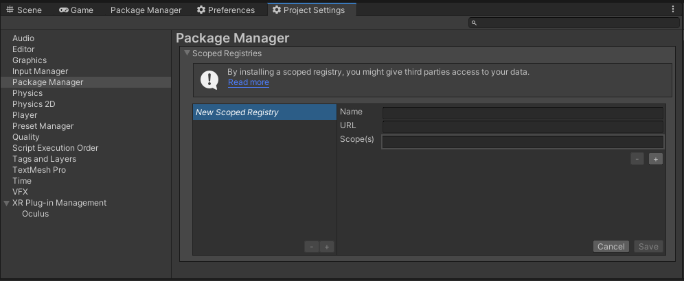

# com.utilities.extensions

[](https://discord.gg/xQgMW9ufN4) [](https://openupm.com/packages/com.utilities.extensions/) [](https://openupm.com/packages/com.utilities.extensions/)

Common extensions and editor utilities for [Unity](https://unity.com/) projects.

## Installation

Requires Unity `2021.3` LTS or newer.

The recommended installation method is via Unity Package Manager with [OpenUPM](https://openupm.com/packages/com.utilities.extensions).

### Via Unity Package Manager and OpenUPM

#### Terminal

```terminal
openupm add com.utilities.extensions
```

#### Manual

- Open Unity project settings.
- Select `Package Manager`.

- Add the OpenUPM scoped registry:
  - Name: `OpenUPM`
  - URL: `https://package.openupm.com`
  - Scope(s):
    - `com.utilities`
- Open the Unity Package Manager window.
- Change the package source from Unity to `My Registries`.
- Install `Utilities.Extensions`.

### Via Git URL

- Open Unity Package Manager.
- Add package from Git URL: `https://github.com/RageAgainstThePixel/com.utilities.extensions.git#upm`

## What's Included

### Runtime Extensions

- `AddressablesExtensions` (`UNITY_ADDRESSABLES && UTILITIES_ASYNC`)
  - Safe handle release helpers.
  - Progress + cancellation helpers for async addressables operations.
  - `DownloadAddressableAsync` for cache-aware downloads.
- `SceneInstanceExtensions` (`UNITY_ADDRESSABLES && UTILITIES_ASYNC`)
  - Scene instance validity checks and async unload helper.
- `ComponentExtensions`
  - `EnsureComponent`, `EnsureComponentDestroyed`, hierarchy lookup, and validation helpers.
- `GameObjectExtensions`
  - Hierarchy traversal helpers, layer utilities, rendering toggles, and ancestor/common-root helpers.
- `TransformExtensions`
  - Hierarchy enumeration, ancestor traversal, depth helpers, bounds helpers, transform size helpers, and recursive utilities.
- `UnityObjectExtensions`
  - Null-safe checks, edit-mode aware destroy/dont-destroy helpers, and instance/entity lookup helpers.
- `NativeArrayExtensions`
  - `AsSpan`, base64 encode/decode, stream/file async IO, copy helpers, and string conversion.

### Runtime Utilities

- `SerializedDictionary<TKey, TValue>`
  - Abstract serializable dictionary base for Unity inspector-backed dictionary patterns.

### Editor Extensions

- `EditorGUILayoutExtensions`
  - Dividers, text area drawing, and progress bar helpers.
- `SerializedPropertyExtensions`
  - Missing reference detection, default value checks/setters, and stable identifier helper.
- `SerializedObjectExtensions`
  - Null-safe checks for serialized objects.
- `ScriptableObjectExtensions`
  - Create/get assets and enumerate all instances.
- `UnityObjectExtensions` (Editor)
  - Asset GUID lookup helper.
- `ProcessExtensions`
  - Synchronous and asynchronous process runner helpers with captured output.

### Editor Utilities

- `AbstractEditorDashboard`
  - Base class for tabbed editor dashboard windows with save-directory controls.
- `GuidRegenerator`
  - Regenerate asset GUIDs recursively, or assign a specific GUID to an asset.
- `ComponentEditorUtility`
  - Context actions to upgrade/downgrade component types while copying serialized values.
- `IconEditor`
  - Batch script icon assignment for selected folders/assets.
- `ProcessResult`
  - Structured process execution result used by `ProcessExtensions`.

### Editor Drawers and Inspectors

- `SerializedDictionaryPropertyDrawer`
  - Reorderable inspector drawer for `SerializedDictionary<TKey, TValue>`.
- `SerializedDictionaryObject`
  - Helper wrapper used to manage serialized dictionary key/value arrays.
- `SceneReferencePropertyDrawer`
  - Inspector scene picker drawer for `SceneReferenceAttribute`.
- `ReadonlyPropertyDrawer`
  - Inspector drawer for `ReadonlyLabelAttribute`.
- `RenderScriptableObjectPropertyDrawer`
  - Inspector drawer for inline scriptable object rendering.
- `LoadSceneButtonEditor` (`UNITY_UGUI`)
  - Custom inspector for `LoadSceneButton`.

### Attributes

- `SceneReferenceAttribute`
  - Scene picker for serialized `string` fields; selected scenes are validated into build settings.
- `ReadonlyLabelAttribute`
  - Read-only inspector field rendering, with optional label copy support.
- `RenderScriptableObjectAttribute`
  - Inline rendering of nested `ScriptableObject` properties in inspectors.

### Behaviours

- `LoadSceneButton` (`UNITY_UGUI`)
  - `Button` subclass that loads a selected scene on click using `SceneReferenceAttribute`.
